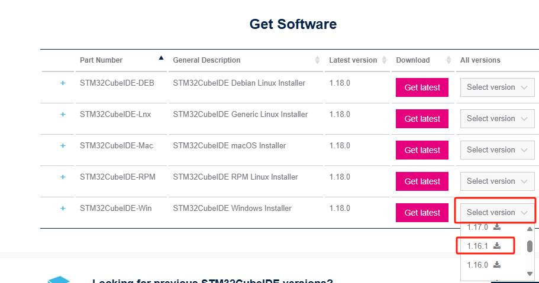
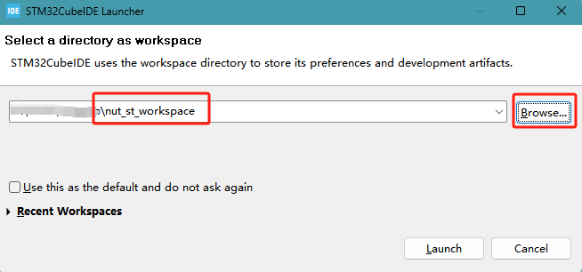
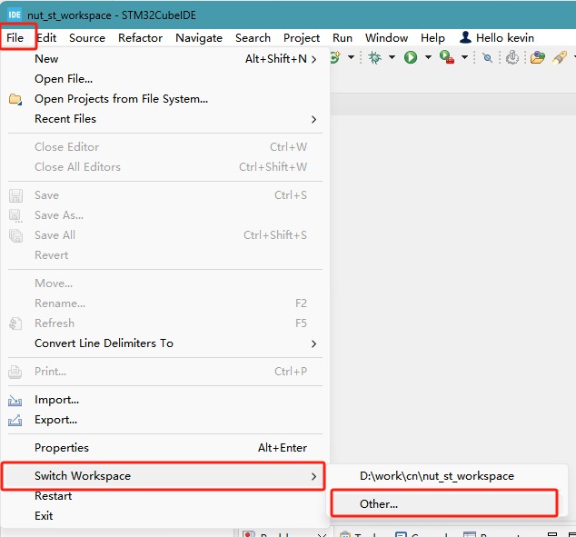
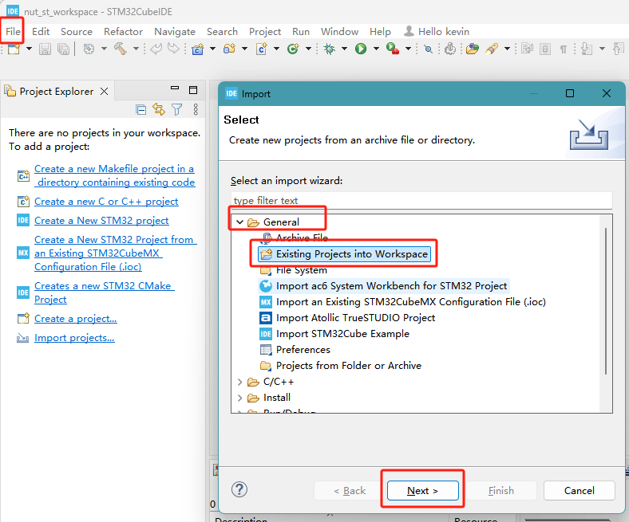
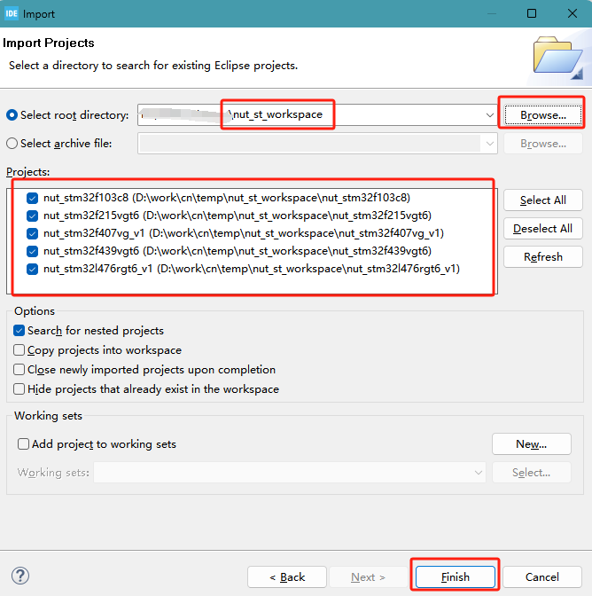
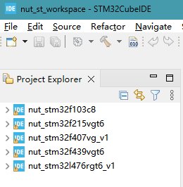
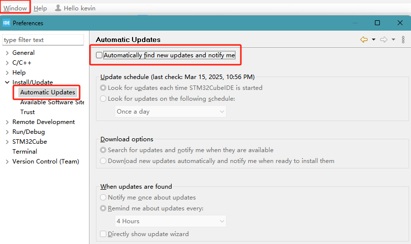

# 介绍

本仓库用于`STM32`芯片的`Nuts` 板开发，支持硬件版本包括：

- stm32f103c8
- stm32f215vgt6
- stm32f407vg
- stm32f439vgt6
- stm32l476rgt6


# 工程建立


## 代码下载

本仓库包含[子模块]<https://git-scm.com/docs/gitsubmodules>，所以克隆需要额外做一些参数：

```shell
git clone --recurse-submodules https://github.com/cracknuts-team/nut_st_workspace.git
```

如果已经克隆了仓库但是没有指定同步子模块，可以使用如下命令：

```shell
git submodule update --init --recursive
```

在执行仓库拉取操作时，也需要额外增加参数来更新子模块：

```shell
git pull --recurse-submodules
```

❗如果你需要更新子模块的代码到最新的提交可执行下面的代码进行更新（注意，此时更新的子模块代码仅仅是子模块的提交，不是主仓库指定的提交，仅推荐在自己开发时使用）

```shell
git submodule update --remote --recursive
```

## 开发软件

项目开发工具使用 [STM32CubeIDE 1.16.1](https://www.st.com/en/development-tools/stm32cubeide.html#st-get-software) ，下载对应版本后安装



## 导入工程

1. 克隆当前代码库

   ```shell
   git clone https://github.com/cracknuts-team/nut_st_workspace.git
   ```

2. 打开`STM32CubeIDE`软件

3. 指定`nut_st_workspace`为工作目录

   打开软件后选择路径到仓库目录

   

   **或者**

   如已打开工程，可以切换到仓库目录，`File -> Switch WorkSpace -> other -> ../nut_st_workspace` 

   

   4. 导入已有工程，`File -> Import -> Existing Porjects into Workspace`，`root directory` 选择 `nut_st_workspace`

      选择导入方式。

      

      选择工程。






## STM32工程开发

可参考相关教程，如：[STM32CubeMX系列教程](https://www.waveshare.net/study/portal.php?mod=list&catid=40)


## 关闭STM32CubeIDE自动升级功能

STM32CubeIDE软件自动升级会导致工程不兼容问题，建议关闭自动升级功能。




---


# Nuts 命令

## 通信协议

**命令格式**

```
┌────────────────-──┬───────┐
│---Request Header--│-------│
│Command│ RFU│Length│PayLoad│
│-------------------│-------│
│  2B   │ 2B │  4B  │$Length│
└───────┴───┴───────┴───────┘
```

**响应格式**

```
┌───────────────────┬───────┐
│--Response Header--│-------│
│ Status │  Length  │PayLoad│
│-------------------│-------│
│   2B   │    4B    │$Length│
└────────┴──────────┴───────┘
```


## 命令


### 设置AES加密密钥

**命令格式**

| Command    | RFU    | Length   | Payload |
| ---------- | ------ | -------- | ------- |
| **0x0100** | 0x0000 | len(key) | key     |

**响应格式**

| Status | Length     | Payload |
| ------ | ---------- | ------- |
| 0x0000 | 0x00000000 | None    |

**示例**

```
send   >> 01 00 00 00 00 00 00 10 00 11 22 33 44 55 66 77 88 99 AA BB CC DD EE FF
return << 00 00 00 00 00 00 
```

**Note: The length of AES key support 16 Bytes(128 bits), 24 Bytes(192 bits) and 32 Bytes(256 bits)**


### 设置AES解密密钥

**命令格式**

| Command    | RFU    | Length   | Payload |
| ---------- | ------ | -------- | ------- |
| **0x0101** | 0x0000 | len(key) | key     |

**响应格式**

| Status | Length     | Payload |
| ------ | ---------- | ------- |
| 0x0000 | 0x00000000 | None    |

**示例**

```
send   >> 01 01 00 00 00 00 00 10 00 11 22 33 44 55 66 77 88 99 AA BB CC DD EE FF
return << 00 00 00 00 00 00 
```

**注意: The length of AES key support 16 Bytes(128 bits), 24 Bytes(192 bits) and 32 Bytes(256 bits)**


### AES加密

**命令格式**

| Command    | RFU    | Length     | Payload    |
| ---------- | ------ | ---------- | ---------- |
| **0x0102** | 0x0000 | 0x00000010 | plain(16B) |

**响应格式**

| Status | Length     | Payload     |
| ------ | ---------- | ----------- |
| 0x0000 | 0x00000010 | cipher(16B) |

**示例**

```
send   >> 01 02 00 00 00 00 00 10 00 11 22 33 44 55 66 77 88 99 AA BB CC DD EE FF
return << 00 00 00 00 00 10 62 F6 79 BE 2B F0 D9 31 64 1E 03 9C A3 40 1B B2
```

### AES解密

**命令格式**

| Command    | RFU    | Length     | Payload     |
| ---------- | ------ | ---------- | ----------- |
| **0x0103** | 0x0000 | 0x00000010 | cipher(16B) |

**响应格式**

| Status | Length     | Payload    |
| ------ | ---------- | ---------- |
| 0x0000 | 0x00000010 | plain(16B) |

**示例**

```
send   >> 01 03 00 00 00 00 00 10 62 F6 79 BE 2B F0 D9 31 64 1E 03 9C A3 40 1B B2
return << 00 00 00 00 00 10 00 11 22 33 44 55 66 77 88 99 AA BB CC DD EE FF
```

### 设置DES加密密钥

**命令格式**

| Command    | RFU    | Length     | Payload |
| ---------- | ------ | ---------- | ------- |
| **0x0200** | 0x0000 | 0x00000008 | key(8B) |

**响应格式**

| Status | Length     | Payload |
| ------ | ---------- | ------- |
| 0x0000 | 0x00000000 | None    |

**示例**

```
send   >> 02 00 00 00 00 00 00 08 88 99 AA BB CC DD EE FF
return << 00 00 00 00 00 00 
```


### 设置DES解密密钥

**命令格式**

| Command    | RFU    | Length     | Payload |
| ---------- | ------ | ---------- | ------- |
| **0x0201** | 0x0000 | 0x00000008 | key(8B) |

**响应格式**

| Status | Length     | Payload |
| ------ | ---------- | ------- |
| 0x0000 | 0x00000000 | None    |

**示例**

```
send   >> 02 00 00 00 00 00 00 08 88 99 AA BB CC DD EE FF
return << 00 00 00 00 00 00 
```

### DES加密

**命令格式**

| Command    | RFU    | Length     | Payload   |
| ---------- | ------ | ---------- | --------- |
| **0x0202** | 0x0000 | 0x00000008 | plain(8B) |

**响应格式**

| Status | Length     | Payload    |
| ------ | ---------- | ---------- |
| 0x0000 | 0x00000008 | cipher(8B) |

**示例**

```
send   >> 02 02 00 00 00 00 00 08 88 99 AA BB CC DD EE FF
return << 00 00 00 00 00 08 97 9F FF 9B 97 0C A6 A4  
```


### DES解密

**命令格式**

| Command    | RFU    | Length     | Payload    |
| ---------- | ------ | ---------- | ---------- |
| **0x0203** | 0x0000 | 0x00000008 | cipher(8B) |

**响应格式**

| Status | Length     | Payload   |
| ------ | ---------- | --------- |
| 0x0000 | 0x00000008 | plain(8B) |

**示例**

```
send   >> 02 03 00 00 00 00 00 08 97 9F FF 9B 97 0C A6 A4
return << 00 00 00 00 00 08 88 99 AA BB CC DD EE FF
```


